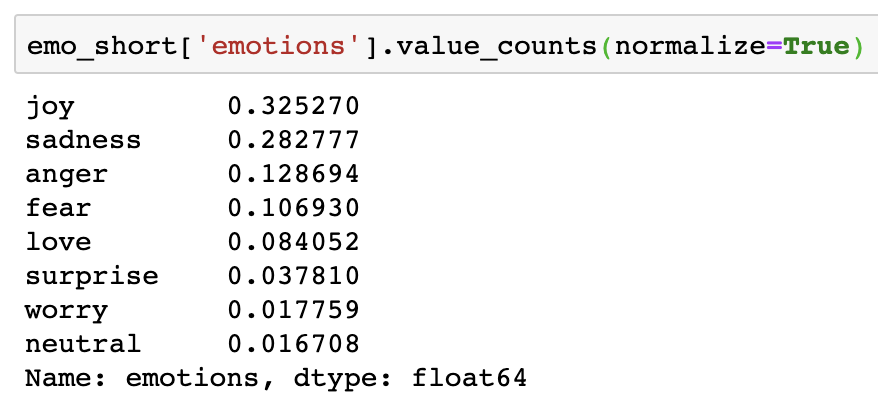
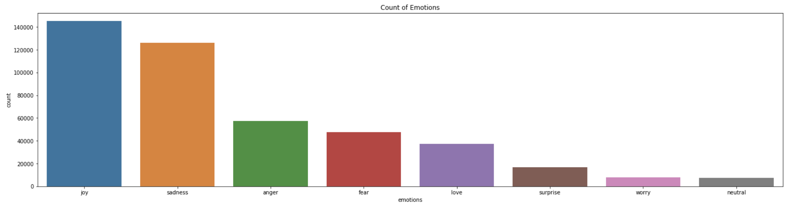
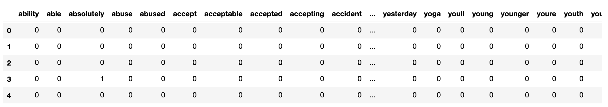
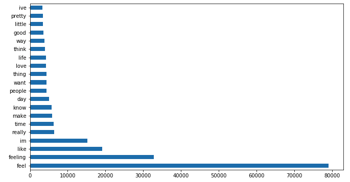
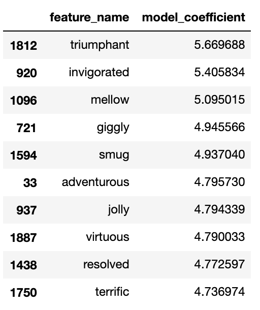
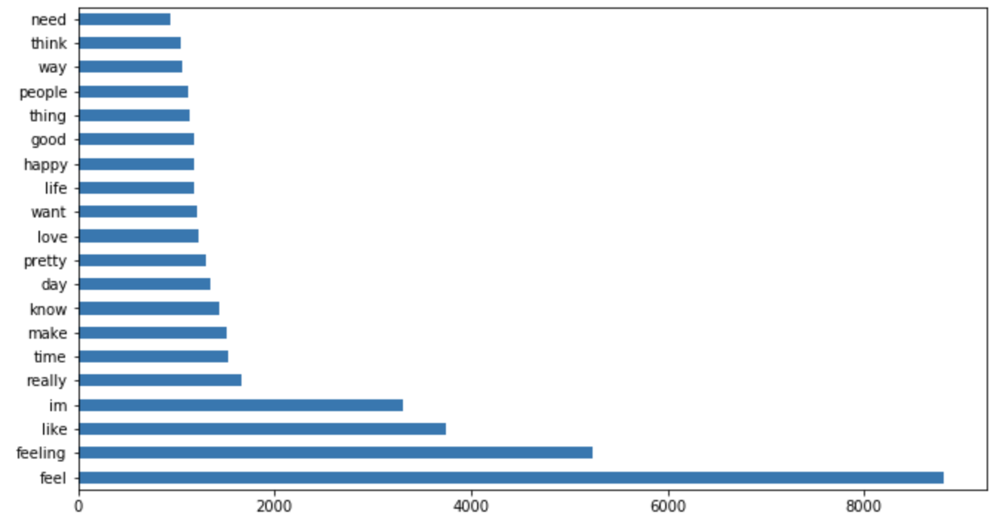
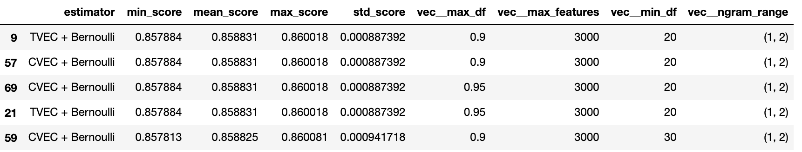
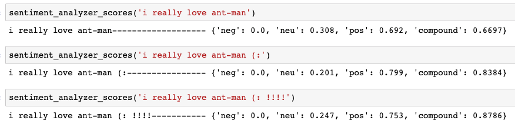
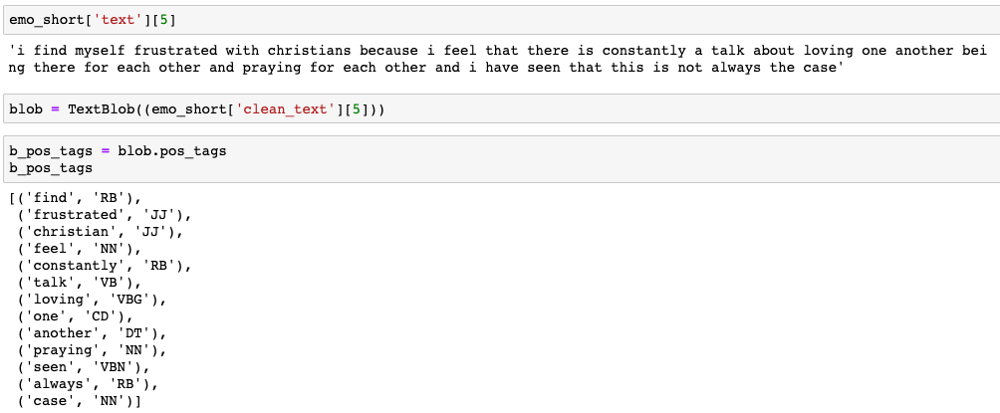
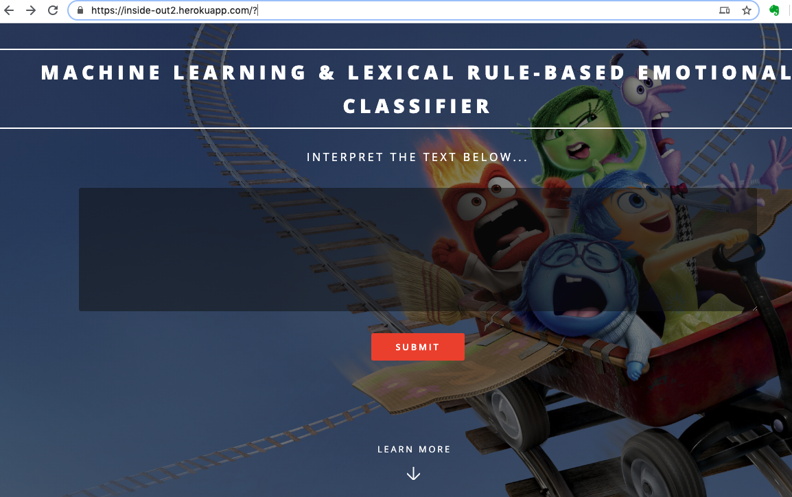

# Background  
> "What is on your mind?... What are you thinking about?... A penny for your thoughts?" For most of us, experiencing, intepreting, understanding and reacting to our own emotional states and those around us are very much a part of our daily interactions at the workplace, at home with our family members and other social settings; **reacting appropriately to different situations based on the emotional context is key to developing meaningful personal / business relationships.** I suspect this is why friends often prefer meeting up in person / business executives insist on having face to face negotiations etc. **However, appreciation of emotional context is often done in-person** - and for good reason - we read emotions best based on tonality, body-language, facial expressions and many other verbal and non-verbal cues perceived both consciously and sub-consciously. For this reason, emotional interpretation is largely limited to a localised / small settings. 
> But **what if we could glean information on emotional responses 'en-masse'** using other less conventional methods? For example, by analyzing the 'tonality' based on a particular style of writing or 'expressions' based on punctuations or other key words used from textual input? What if we could tell how a hundred, or a thousand people are feeling at a particular point in time and specifically about what -- in real time no less. These questions motivated my research into the field of Natural Language Processing (NLP) and the development of a tool that is built on both traditional Machine Learning/NLP concepts and lexical rule-based libraries that other researchers have built to efficiently provide 'emotional data' en-masse using text as input.  

## Problem Statement 
It is difficult to gather emotional responses (quickly/cheaply/efficiently) at scale.  

## Proposed Solution 
A web-application that can process textual input to provide both a broader analysis of the emotional response to specific topics (e.g. Singapore General elections) and a more granular analysis of sentence-level emotional responses and associated key-words/phrases. 

*current model is only built for text input of up to a few paragraphs long 

## Methods Applied 
    
1. Natural Language Processing: pre-process text (vectorizing, lemmatizing etc), and to break it down in a way that best captures the context and sentiment of the textual input (e.g. n-grams, number of word features)  

2. Classification modelling: train the model against the tagged emotional state to accurately classify emotions according to textual input using an appropriate statistic model  

3. Lexical Rule-based libraries: lexical libraries that have been manually curated to pre-assign sentiment scores to specific key-words, word orderings etc according to a rule-based approach.  

## Data 
1. Pre-tagged Kaggle dataset for emotions based on 450,000 tweets  
2. Pre-tagged Figure-eight dataset (~50,000) text messages 
3. Pre-tagged Figure-eight dataset (~2,500) text inputs 

----
The following are some examples of potential painpoints & use cases for 'emotional-listening': 

**Pain Points** 

**1. Costly and time-consuming to gather mass implicit feedback:** 

Information on the emotional response to an event (could be a press release, a public speech etc) could be helpful for better decision making (e.g. reactions toward a certain action or policy) but obtaining this implicit feedback in real-time and on a mass level is often costly and time-consuming, if even possible. While explicit emotional feedback could be obtained from social media platforms like facebook (e.g by calculating the % of likes, or angry emojis reacts etc) this would only provide a snapshot in reaction to something (i.e. a secondary reaction). It would be more powerful if we could get that same analysis implicitly based on individual's textual input (a primary reaction) on publicly accessible platforms. 

**2. Difficult to obtain real-time information to take preventive action:**

Unfortunate events like mass-killings are often preceded by telling messages indicative of troubled emotions before the incidents happen but are usually only discovered only post-mortem.    

**3. Lack of nuance in basic sentiment analysis:**

Current sentiment analysis is usually binary. However, even within the broad categories of ‘good’ or ‘bad’ it would be helpful to understand what kind of ‘good’ or ‘bad’ -- and at what intensities -- in order to respond more appropriately to the reaction. For example, a product review of an Iphone could have been assigned a 'bad' / negative sentiment score but this negative sentiment could have been disappointment, anger or any other 'negative' emotion for that matter - in which case, (Apple's) response would be very different; the user could be disappointed that a particular feature was not released, or angry that the quality of the phone is sub-par. The former reaction could be considered as a subjective opinion that would be good to keep in mind as a potential feature add on for future releases whereas the latter reaction would need to be re-examined with much greater urgency as the potential ramifications of a faulty phone is much greater.   

**Use-cases** 
    
1. Emotional analysis as an additional data point for digital marketing 

2. Better recommendation systems (think Spotify songs that are mood appropriate) 

3. Real time 'emotional-listening' used to pre-empt bad events from happening. Web-app could be 'always listening' to an online source (e.g. twitter) by dynamically scraping information from that online source and generating real-time information on the breakdown of emotions and associated key-phrases

4. Used for more granular sentiment analysis (for policy makers, anything thats find an emotional response informative)

5. Mental health tracker: individuals can journal and put their journal through this analyser, which will help to track their emotions at chosen time intervals over time 

6. To help with disabilities: if a speech to text function can pass info through this model to return feedback on emotions, it can help those with an impaired ability to pick up emotional nuances through daily text/speech based interactions.

8. In general, as an additional data point — layered on top of other structured and unstructured data inputs (ppl posting live videos on facebook, insta-stories etc) 

----

# 1.Data Cleaning and Pre-Processing

## 1.1 Combining 3 datasets 

The Kaggle dataset (~415,000 tweets) had been pre-tagged according to 6 emotional states ('sadness', 'joy', 'anger', 'fear', 'surprise'). As I didn't have to scrape for these inputs off Twitter directly there was much less pre-processing to be done (e.g. in terms of cleaning up the HTML or accessing the correct data in a nested dictionary as is usually the case with raw data scrapes)  

The Figure eights datasets had fewer observations (~40,000 and 2,500 respectively) but a wider range of 13 and 18 emotions. Similar to the kaggle dataset, Figure eight had already ordered the inputs nicely into a .csv file which I could load directly into my Jupyter notebook for further processing.   

Overview of the emotions captured in the 3 datasets:

1. 'sadness', 'joy', 'love', 'anger', 'fear', 'surprise'

2. 'empty', 'sadness', 'enthusiasm', 'neutral', 'worry', 'surprise', 'love', 'fun', 'hate', 'happiness', 'boredom', 'relief', 'anger'

3. 'Neutral', 'Anger', 'Optimism', 'Disgust', 'Sadness','Anticipation', 'Aggression', 'Submission', 'Love', 'Surprise','Contempt', 'Disapproval', 'Remorse', 'Ambiguous', 'Fear', 'Joy',

After cleaning out the unecessary columns and re-naming some column headings to ensure consistency, I concatenanted all 3 datasets containing all emotional states.  

<figure>
	
	<figcaption>Bar chart showing all emotions from 3 datasets (%) </figcaption>
</figure>

## 1.2 Problem of Imbalanced Data

There was clearly a long-tail of (more nuanced) emotion-types that had far less observations than other 'plain-vanilla' emotional types like 'joy', 'anger' etc. This would lead to an imbalanced dataset that would impact the model's prediction accuracy as it would not have as many datapoints of the less represented emotions to be sufficiently 'trained' on. 

For this reason, I chose to subset only the top 8 emotions by count to form the final dataset that I would be training my model on. 

<figure>
	
	<figcaption> % Breakdown of Emotion Shortlist </figcaption>
</figure>

<figure>
	
	<figcaption>Bar chart showing Emotion Shortlist </figcaption>
</figure>

However, as we can tell, even after shortlisting the top 8 emotions by count, there is still a rather large imbalance (as % of total observations) between top 8 emotions. I plan to deal with this using traditional random upsampling within each emotion-class after train-test-split, in order to prevent the same observations from being present in both the training and testing sets. 

I did not balance out the classes during the construction of my baseline-model. 

## 1.3 Cleaning up training set text input 

I wrote a function that takes in the raw text input from the training set, strips it of non-letters, converts it to lower case, removes all stopwords and lemmatizes the words before concatenating individual words back into a 'cleaned' string. 

I used this 'cleaned' input as the basis for the building of my base line model. 



import libraries
from bs4 import BeautifulSoup   
import regex as re
from nltk.corpus import stopwords 
from nltk.stem import WordNetLemmatizer

# Instantiate lemmatizer 
lemmatizer = WordNetLemmatizer()

# Cleaning Function 
def clean_text(raw_post):
    
    # 1. Remove HTML.
    review_text = BeautifulSoup(raw_post).get_text()
    
    # 2. Remove non-letters.
    letters_only = re.sub("[^a-zA-Z]", " ", review_text)
    
    # 3. Convert to lower case, split into individual words.
    words = letters_only.lower().split()
    # Notice that we did this in one line!
    
    # 4. In Python, searching a set is much faster than searching
    # a list, so convert the stop words to a set.
    stops = set(stopwords.words('english'))
    
    # 5. Remove stop words.
    meaningful_words = [w for w in words if not w in stops]
    
    # 6. Lematize 
    lem_meaningful_words = [lemmatizer.lemmatize(i) for i in meaningful_words]
    
    # 7. Join the words back into one string separated by space, 
    # and return the result.
    return(" ".join(lem_meaningful_words))



Looping through raw text inputs to clean the entire training set. 



total_posts = emo_short.shape[0]
print(f'There are {total_posts} total posts.')

# Initialize an empty list to hold the clean posts.
clean_posts = []

print("Cleaning and parsing the whole set...")

j = 0
for i in emo_short['text']:
    # Convert post to words, then append to clean_train_posts.
    clean_posts.append(clean_text(i))
    
    # If the index is divisible by 10000, print a message
    if (j + 1) % 10000 == 0:
        print(f'Post {j + 1} of {total_posts}.')
    
    j += 1



There were 5519 values that turned up null after the cleaning process. That's only 1.22% of the initial total observations that had to be dropped, meaning that we still had a bulk of our dataset (~98%) to work with - not too bad.

## 1.4 Cleaning difficulties 

1. Selectively keeping special characters that convey useful information e.g. emojis 

2. Removing/contracting words with character repetitions (e.g. whaaaaaat => what)
> might have to create a manual dictionary that removes specific words (complete fail safe method)
> otherwise you could create a generalizable regex code that contracts anything with more than 2 repeated characters to a single character - though this would leave out words that have only two repeated characters but it would still be an improvement over the raw dataset. 

3. Transforming contracted words to their normal forms e.g. can't to cannot (so that the same word is not counted as two distinct words) 

4. Removing stop words while maintaining negations (e.g. not, no, nor) to preserve the intention.

5. Separating 'concatenated' words (e.g. iloveyoutodeath) 

6. Correcting mis-spelt words (e.g. 'beleive' vs 'believe') 

7. Probably also want to strip user-names (i.e. @XYZ) so that they do not get picked up as word features 

# 2. Baseline Model

## 2.1 Train-Test-Split 

First we have to split the data set into a training set which is used to train the model on, and a testing set which is used to test the efficacy of the trained model. 



# Import train_test_split.
from sklearn.model_selection import train_test_split

X = emo_short['clean_text']
y = emo_short['emotions_label']

# Create train_test_split.
X_train, X_test, y_train, y_test = train_test_split(X, #this is the X (predictor vars)
                                                    y, #this is the y (target var)
                                                    #stratify=y, #preserves the ratio of X:y in train and test sets
                                                    test_size = 0.25,
                                                    random_state = 42)


## 2.2 Vectorizing word features in training and testing sets 

Next we have to vectorize the word features to convert it from word to numerical format in order for the 'machine learning' to take place. 

There are 2 types of vectorizers that can be used, Countvectorizer counts the number of each unique word feature in a given string while Term-frequency Inverse Document Frequency (TFIDF) Vectorizer assigns a score to each word feature based on the number of times that word is present in a sentence relative to it's presence across all other sentences in a given dataset (or body of text). 


from sklearn.feature_extraction.text import CountVectorizer, TfidfVectorizer

# Instantiate our Vectorizers.
cvec = CountVectorizer(stop_words = 'english', 
                       max_features = 2000, 
                       min_df = 10)

tvec = TfidfVectorizer(stop_words = 'english', 
                       max_features = 2000, 
                       min_df = 10)

# Fit & transform our Count/TFID Vectorizer on the training data and transform training data.
X_train_cvec = cvec.fit_transform(X_train)
X_train_tvec = tvec.fit_transform(X_train)

X_train_cvec_df = pd.DataFrame(X_train_cvec.toarray(), 
                               columns = cvec.get_feature_names())

X_train_tvec_df = pd.DataFrame(X_train_tvec.toarray(), 
                               columns = tvec.get_feature_names())

#Transform our test set 
#reminder to self: we only transform and not fit the test set again because we only want features present in the 
#training set to be used for the test set (otherwise model trained on training set cannot be used on the test set)
X_test_cvec = cvec.transform(X_test).todense() 
X_test_tvec = tvec.transform(X_test).todense() 

X_test_cvec_df = pd.DataFrame(X_test_cvec, 
                              columns = cvec.get_feature_names())

X_test_tvec_df = pd.DataFrame(X_test_tvec, 
                              columns = tvec.get_feature_names())



I started off by using the CountVectorizer. The results below are a snippet of the original output after converting word features into numerical form using the CountVectorizer. We are clearly facing a **sparse-matrix problem**. A sparse-matrix occurs when there are many unique (word) features that occur only once or a few times across in the entire dataset, leaving the matrix with many null values, and hence resulting in a 'sparse-matrix'. This is problematic because we now have an extremely tall (high number of rows) and wide (high number of columns) dataset that makes it computationally expensive for the model to train on. 

For context, without restricting the number of word features (as one of the parameters) when using the CountVectorizer on my dataset, the total number of unique features total to **70,000+**. Given that my training set has almost 350,000 rows, the entire matrix would contain a whopping **23,425,430,000** cells -- Yes, that is a whopping 23+ billion values that the computer has to read into memory if we were training on this sparse matrix. In fact, when I tried it my system's kernel crashed -- clearly not a good idea. 

<figure>
	
	<figcaption> Sparse matrix containing unique word features </figcaption>
</figure>

**To deal with the sparse-matrix problem** I ended up limiting the number of word features to 2,000 to keep the matrix more manageable (669,298,000 cells - still no small number, but far more manageable). I further restricted the unique word feature set by limiting it to the selection of words that appeared in the dataset at least 10 times - in order to prevent meaningless words from being captured. (e.g. colloquialisms like 'aaaaaaah!!!!' or 'ssssshhhiiitttt') 

**Finding the most frequently used words** 

After vectorizing the word features, I combined both training and test sets to find out which words had the highest number of counts for each of the 8 emotions. 


joy_df = train_cvec_combined_df[train_cvec_combined_df['emotions_label']==2]
joy_df.drop('emotions_label', axis=1, inplace = True)
top_20_joy = joy_df.sum().sort_values(ascending=False).head(20)
top_20_joy.plot.barh(figsize=(11,6));


<figure>
	
	<figcaption> Top 20 word features for 'Joy' by Count </figcaption>
</figure>

The key observation here was that there was quite a few overlapping frequently used words across the 8 emotion classes, most of which were not particularly informative (e.g. words like 'im', 'feeling', 'feel', 'know', 'day'). This indicated that perhaps CountVectorizer might not be the best vectorizer to use in this instance as it was capturing frequently used words that were not meaningful in distinguishing between the different emotional classes. 

This was confirmed when I combined the top 20 words across all 8 emotion classes to find that that only 59 out of 160 or 36.8% of the most frequently used words were unique. 

**Finding words with the highest coefficients**

Next I extracted the words that my baseline logistic regression model has assigned the highest coefficients to for each emotion. In comparison to the top word features by count, the selected word features were much more distinctive and unique.  

<figure>
	
	<figcaption> Top 10 word features for 'Joy' by LogReg Coefficient </figcaption>
</figure>

**There were a few improvements that I can make based on these observations**:
1. Consider using a TFIDF Vectorizer since it will penalize terms that get used too frequently across the dataset
2. Expand my list of stopwords to include less meaningfull words like word contractions 

## 2.3 Fitting the Baseline Model 

Used a simple CountVectorizer and Logistic Regression for my baseline model. 


#Fit the model
lr = LogisticRegression(max_iter=400000)
baseline_model = lr.fit(X_train_cvec, y_train)


**Baseline model metrics:** 

cross validation scores = [0.84857314, 0.84725833, 0.84721351, 0.8480502,  0.84719628]

Baseline Model Train score: 0.865

Baseline Model Test score: 0.849

Overall the resuts are positive. 

The k-fold cross validation scores show that accuracy is consistent across 5 tests, indicating that the model is not overfitted. This is also corroborated by the test scores scoring only slightly lower than the train scores. 

# 3. Tuning Baseline Model & Fitting on Alternative Models  

**1. Using TFIDF vectorizer instead of CountVectorizer with the same Logistic Regression Model** 

Based on my previous results using the CountVectorizer, I would have expected the top words by TFIDF value to produce a set of words that were perhaps more distinctive/unique than with the CountVectorizer. However, I was surprised to find out that this was not the case. In fact, most of the top words were similar to that when using the CountVectorizer.

<figure>
	
	<figcaption> Top 20 word features for 'Joy' by TFIDF Value </figcaption>
</figure>

The model scores also performed approximately similar to that of the CountVectorizer, in fact, to my surprise it **performed slightly worse than with the CountVectorizer.** 

Baseline Model Train score: 0.848

Baseline Model Test score: 0.841

**2. Naive Bayes** 

I used the pipeline function to create a pipeline that passed on vectorized text inputs using both `CountVectorizer` and `TfidVectorizer` to 2 different Naive Bayes models: Bernoulli, Multinomial. 

For example the pipeline that I labelled as `'TVEC + Bernoulli': Pipeline([("vec",TfidfVectorizer()),("nb",BernoulliNB())])` will first vectorize the predictor and target variables using the TfidVectorizer and then pass it onto the Naive Bayes Bernoulli Model.  

Using a pipeline is a very helpful especially when there are multiple steps in the modelling process to ensure that none of the steps are accidentally skipped.  


#Generating the 2 dictionary inputs as arguments for the class function above
#note to self: be careful when keying in the params; name__features needs to be two underscores __ not one _ 

# Import our model!
from sklearn.naive_bayes import BernoulliNB, MultinomialNB, GaussianNB

# Instantiate our model!
nb = BernoulliNB()
mb = MultinomialNB()
#gb = GaussianNB()

models1 = {
    'TVEC + Bernoulli': Pipeline([("vec",TfidfVectorizer()),("nb",BernoulliNB())]),
    'TVEC + Multinomial': Pipeline([("vec",TfidfVectorizer()),("mb",MultinomialNB())]),
    'CVEC + Bernoulli': Pipeline([("vec",CountVectorizer()),("nb",BernoulliNB())]),
    'CVEC + Multinomial': Pipeline([("vec",CountVectorizer()),("mb",MultinomialNB())])
}

params1 = {
    'TVEC + Bernoulli': {'vec__max_features': [1000, 2000, 3000],
                         'vec__min_df': [20, 30],  #at least 2 or 3 features 
                         'vec__max_df': [.9, .95],  #go up to 90 or 95%
                         'vec__ngram_range': [(1,1), (1,2)] #only unigram, or unigram as well as bigram
                            },
    'TVEC + Multinomial': {'vec__max_features': [1000, 2000, 3000],
                            'vec__min_df': [20, 30],  #at least 2 or 3 features 
                            'vec__max_df': [.9, .95],  #go up to 90 or 95%
                            'vec__ngram_range': [(1,1), (1,2)] #only unigram, or unigram as well as bigram
                            },
    'CVEC + Bernoulli': {'vec__max_features': [1000, 2000, 3000 ],
                             'vec__min_df': [20, 30],  #at least 2 or 3 features 
                             'vec__max_df': [.9, .95],  #go up to 90 or 95%
                             'vec__ngram_range': [(1,1), (1,2)] #only unigram, or unigram as well as bigram
                        },
    'CVEC + Multinomial': {'vec__max_features': [1000, 2000, 3000],
                             'vec__min_df': [20, 30],  #at least 2 or 3 features 
                             'vec__max_df': [.9, .95],  #go up to 90 or 95%
                             'vec__ngram_range': [(1,1), (1,2)] #only unigram, or unigram as well as bigram
                            }

}


I subsequently passed on these pipelines along with a range of parameters for each pipeline into a manually defined parameter tuning class.

The manually defined class -- named `EstimatorSelectionHelper` -- is instantiated by taking in a list of models and their respective parameters (as defined above).

`EstimatorSelectionHelper` contains a `.fit` function that takes in the predictor and target variables and passes them onto `Sklearn`'s `GridSearchCV` function to generate scores for different model-parameter combinations. (96 in this case) 

Finally, `EstimatorSelectionHelper` has a `.score_summary` function that takes in the fitted results from the `.fit` function and presents the relevant details in an easily digestible dataframe format. 


#import pandas as pd
#import numpy as np
#from sklearn.model_selection import GridSearchCV

class EstimatorSelectionHelper:

    def __init__(self, models, params):
        if not set(models.keys()).issubset(set(params.keys())):
            missing_params = list(set(models.keys()) - set(params.keys()))
            raise ValueError("Some estimators are missing parameters: %s" % missing_params)
        self.models = models
        self.params = params
        self.keys = models.keys()
        self.grid_searches = {}

    def fit(self, X, y, cv=3, n_jobs=3, verbose=1, scoring=None, refit=False):
        for key in self.keys:
            print("Running GridSearchCV for %s." % key)
            model = self.models[key]
            params = self.params[key]
            gs = GridSearchCV(model, params, cv=cv, n_jobs=n_jobs,
                              verbose=verbose, scoring=scoring, refit=refit,
                              return_train_score=True)
            gs.fit(X,y)
            self.grid_searches[key] = gs    

    def score_summary(self, sort_by='mean_score'):
        def row(key, scores, params):
            d = {
                 'estimator': key,
                 'min_score': min(scores),
                 'max_score': max(scores),
                 'mean_score': np.mean(scores),
                 'std_score': np.std(scores),
            }
            return pd.Series({**params,**d})

        rows = []
        for k in self.grid_searches:
            print(k)
            params = self.grid_searches[k].cv_results_['params']
            scores = []
            for i in range(self.grid_searches[k].cv):
                key = "split{}_test_score".format(i)
                r = self.grid_searches[k].cv_results_[key]        
                scores.append(r.reshape(len(params),1))

            all_scores = np.hstack(scores)
            for p, s in zip(params,all_scores):
                rows.append((row(k, s, p)))

        df = pd.concat(rows, axis=1).T.sort_values([sort_by], ascending=False)

        columns = ['estimator', 'min_score', 'mean_score', 'max_score', 'std_score']
        columns = columns + [c for c in df.columns if c not in columns]

        return df[columns]


**Results for Naive Bayes Models** 

<figure>
	
	<figcaption> Top 5 Gridsearch Scores </figcaption>
</figure>

The top score goes to the TVEC + Bernoulli combination, with an accuracy score of 0.858. However, CVEC + Bernoulli achieved almost similar scores - which is consistent with scores from the Logistic Regression model -- indicating that CVEC of Tfid does not make too much of a difference in terms of improving the model's accuracy. 

The results also show that an n_gram range of (1,2) and the max_feature size of 3,000 has consistently been chosen as the optimal parameters. These results are intuitive as a larger n_gram range would be able to better capture the context of different word feature combinations better (e.g. 'not happy' vs 'happy') while a larger word feature set, although computationally expensive would be able to improve the accuracy of the model as it is 'training' on more observations.

**3. Random Forest & Extra Classified Trees**

I tried fitting the dataset on Random Forest and Extra Classified Trees model next. I had intially started off with 1000 trees but that ran for a rather long time and eventually cause my kernel to crash (not surprising given that there are about half a million rows of data). So I settled with 10 trees. 


from sklearn.tree import DecisionTreeClassifier
from sklearn.ensemble import RandomForestClassifier, ExtraTreesClassifier

rf = RandomForestClassifier(n_estimators=10)
et = ExtraTreesClassifier(n_estimators=10)



**Random Forest Scores** 
rf_train_score = 0.947
rf_test_score = 0.808

**Extra Classified Trees Scores** 
et_train_score: 0.951
et_test_score: 0.811

Random forest scores at 0.80 performs worse then both Naive Bayes and Logistic Regression - though it might have performed better with more trees. However it's very computationally expensive and prone to overtraining, as evidenced by how much higher the accuracy score for the training set as compared to the test set.

I had expected Extra Classified Forest to be less overfitted than Random forests (as ECF is supposed to have random splits on top of selecting for a random subset of features for each tree) but it actually became more overfitted. However, this could also be a function of the fact that I've only used 10 trees. In any case, there is no significant improvement over the Random Forest model.

**4. Support Vector Machine**

I gave up running SVM because it took way too long (couple of hours). Additionally, results from Vader's research paper concluded that SVM is very computational expensive and does not yield any particularly spectacular results over the other more 'plain vanilla' classification models (as fitted above) in this particular use (i.e. for NLP) case anyway.


# Import packages.
from sklearn.svm import SVC

# Instantiate support vector machine.
svc = SVC(kernel = 'poly')

# Fit support vector machine to training data.
svc_model = svc.fit(X_train_cvec, y_train)

#svc_test_score = svc_model.score(X_test_cvec, y_test)
print("SVC Test Score:", svc_test_score)


**5. Artificial Neural Network**


from keras.models import Sequential
from keras.layers import Dense
from keras.utils import to_categorical

#defining model type
nn_model = Sequential()

#first hidden layer
nn_model.add(Dense(256, 
                input_dim = n_input,
                activation ='relu'))

#defining output layer
nn_model.add(Dense(n_output, activation='softmax'))

nn_model.compile(loss='categorical_crossentropy', optimizer='adam', metrics=['accuracy'])

history = nn_model.fit(X_train_cvec, y_train, validation_data=(X_test_cvec, y_test), epochs=2, batch_size=None)



**Results** 
1. Model 1:
    - 2 layers, 32 nodes 
    - Batch size 512, 10 epochs
    - results: validation accuracy peaked at 0.85 and started decreasing quickly after 1.5 epochs, meaning that it was rapidly overfitted

2. Model 2
    - 2 layers, 256 nodes 
    - Batch size: none (i.e. stochastic), 2 epochs 
    - the graphs look equally horrible. validation results show little to no improvement at all 

Both models achieved an accuracy of about 0.85 which is similar to the baseline model. 

# 5. Model Selection 

Summary of models tested: 
1. Logistic Regression (using both CVEC and TVEC)
2. Naive Bayes (Mutinomial and Binomial using both CVEC and TVEC)
3. Random Forest
4. Extra Classified Forest
5. Support Vector Machine
6. Artificial Neural Network 

The results were similar for Log Reg (CVEC) and Naive Bayes (best model was TVEC + Bernoulli) at 0.85 accuracy score. Random Forest and Extra Classified Forest models were quite heavily overfitted, and had a lower accuracy score and was also more computationally expensive. Support Vector machine was simply not considered because it would be too computationally expensive as well. Artificial Neural Network model similarly achieved a similar accuracy to the baseline model - so no point employing this when we can use a simpler method.

Overall I decided that the **baseline model of a CountVectorizer and Logistic Regression Model was still the best performing model** relative to the alternatives that we tried. I came to this conclusion based on the fact that it's accuracy score was equal to if not better than most of the alternative models and it appears to be the most computationally efficient model. Thus  I chose to priorize computational efficiency over the slight score improvement (as with Naive Bayes) keeping in mind that my end goal is to deploy this model in a web-application on Heroku (which has limited memory space in the free tier).  

# 6.Using Lexcial Rule Based Libraries For Sentiment Analysis and Text Mining 

In addition to providing an emotional classification at the individual sentence level, I wanted to utilize specific lexical rule-based libraries to help contextualize those emotions by providing a valence score and by highlighting specific noun-phrases, adjectives and verbs in each sentence that could be associated with the classified emotion.

For example, my model could classify a sentence as being 'angry', but without further context it would be difficult for the user to understand why is has been classified as such. By further providing relevant phrases like "treated unfairly" or "outrageous responses", one would have a better understanding first, of whether the classification was accurate, and second, what exactly is that classified emotion being associated with. 

**1. VADER** 

The first library that I used is the `VADER Sentiment Analyzer` (Valence Aware Dictionary and sEntiment Reasoner).

VADER, as described by the creators of this library is "the Python code for the rule-based sentiment analysis engine. It implements the grammatical and syntactical rules described in the paper, incorporating empirically derived quantifications for the impact of each rule on the perceived intensity of sentiment in sentence-level text. Importantly, these heuristics go beyond what would normally be captured in a typical bag-of-words model. They incorporate word-order sensitive relationships between terms." [Source](https://github.com/cjhutto/vaderSentiment#about-the-scoring){:target="_blank"}

As mentioned, VADER accounts for what a bag-of-words model like my baseline model cannot properly account for - that is, the nuances with which the (english) language is written; these nuances come in the form of emoticons, captalisation and so on.

An example of Vader's lexical library: 

(-:0	2.8	0.87178	[3, 2, 3, 4, 3, 2, 3, 1, 4, 3]
(-:<	-0.4	2.15407	[-3, 3, -1, -1, 2, -1, -2, 3, -3, -1]
(-:o	1.5	0.67082	[3, 1, 1, 2, 2, 2, 1, 1, 1, 1]
(-:O	1.5	0.67082	[3, 1, 1, 2, 2, 2, 1, 1, 1, 1]
(-:{	-0.1	1.57797	[-2, -3, 1, -2, 1, 1, 0, 0, 2, 1]
(-:|>*	1.9	0.83066	[3, 2, 2, 1, 0, 2, 3, 2, 2, 2]
(-;	1.3	1.18743	[3, 2, 3, 0, 1, -1, 1, 2, 1, 1]


<figure>
	
	<figcaption> Example of how Vader Scores </figcaption>
</figure>

**How does VADER add context?** 

1. Valence as related to, but different from emotion

>Valence, as used in psychology, especially in discussing emotions, means the intrinsic attractiveness/"good"-ness (positive valence) or averseness/"bad"-ness (negative valence) of an event, object, or situation. The term also characterizes and categorizes specific emotions. For example, emotions popularly referred to as "negative", such as anger and fear, have negative valence. Joy has positive valence.

>However, certain words could carry -ive/+ive valences that are not necessarily clearly assoiated with a particular emotion or another. By provding both valence and emotion, I am providing an additional layer of context to a sentence. For example "i think that you are a racist person" could carry a -ive valence because of 'racist' but does not tell me anything about the emotion of the person (could be saying it matter of factly... in love or angrily)

2. Valence score as indicator of emotional intensity 

>Two sentences could have the same emotional classification e.g. angry, but one with a more negative valence could be interpreted as being more 'intensely angry' than the other. 

3. Valence score as 'check' for Machine Learning Model

>As discussed above, valences should correspond with particular emotions. Negative emotions like 'sadness' or 'anger' should have a negative valence score. If this is not the case, then either VADER or the model has misclassified the emotion - it hence 'checks' for the validity of the ML's classification.

I highly recommend reading about the following paper "VADER: A Parsimonious Rule-based Model for Sentiment Analysis of Social Media Text" to get a more complete understanding of how the tool works. 

**2. Textblob** 

Textblob is "a Python (2 and 3) library for processing textual data. It provides a consistent API for diving into common natural language processing (NLP) tasks such as part-of-speech tagging, noun phrase extraction, sentiment analysis, and more."
[Source](https://textblob.readthedocs.io/en/dev/quickstart.html#part-of-speech-tagging){:target="_blank"}

I utilized Textblob to extract noun-phrases and it's part-of-speech (POS) tagging function to extract adjectives and verbs. 

<figure>
	
	<figcaption> Textblob part-of-speech tags </figcaption>
</figure>

This is an example of how Textblob breaks down a sentence and provides 'tags' to relevant words. For my purposes, i am only interested in 'JJ' (adjectives) and 'VB' (verbs). 

**3. Other libraries** 

There are other libraries that have other very useful Natural Language Processing tools. 2 such libraries that I was considering using were the topic mining and named-entity-recognition functions from `Gensim` and `Spacy` respectively.  

However after experimenting with relatively small text inputs (which is what i'm currently building my web-app for) I figured that Textblob and Vader were sufficient for my purposes.  

# 7. Combining different functions for Deployment 

To summarize where we have gotten so far, we have: 
1. Cleaned and transformed our data set of ~0.5 million observations 
2. Built a machine learning model to classify emotions 
3. Used Vader for valence scoring 
4. Used TextBlob for noun-phrases and part-of-speech tagging

The goal now is to combine all these steps into a single function that takes in a chunk of text (whether single sentence of a few paragraphs long), cleans and prepares the data to be passed onto the model, VADER and Textblob in order to produce a sentence level breakdown of the classified emotion, valence score, and relevant key words and phrases.


#libraries to import 
#vader, textblob, spacy, logreg, pickle nltk, countvect, pandas, numpy, matplotlib
import numpy as np
import pandas as pd
from sklearn.linear_model import LogisticRegression
from sklearn.feature_extraction.text import CountVectorizer, TfidfVectorizer
import pickle 
from vaderSentiment.vaderSentiment import SentimentIntensityAnalyzer
#import spacy
import nltk 
from textblob import TextBlob
import matplotlib.pyplot as plt

vader = SentimentIntensityAnalyzer()
#nlp_spacy = spacy.load('en_core_web_sm')
    
def emo_machine(text_string_input):    
    
    #instantiating a dataframe to which we will add columns of data
    emo_summary = pd.DataFrame()
    
    #a list to store vader scores for each sentence from the input
    vader_scores = []

    #list to add textblob noun-phrases
    bnp = []
    
    #list to add textblob POS tags
    b_pos_tags = []
    pos_subset = ['JJ'] #pre-define which POS tags you would like to select for; in this case, only adjectives
    
    #import the baseline emotion classification model from the pickled file 
    pickle_in = open("lr_baseline_model","rb")
    lr_baseline_model = pickle.load(pickle_in)
    
    #import the fitted countvectorizer from the pickle file 
    pickle_in = open("cvec","rb")
    cvec = pickle.load(pickle_in) 
    
    #import the cleaning function from the pickle file
    pickle_in = open("clean_text","rb")
    clean_text = pickle.load(pickle_in)
    
    # Initialize an empty list to hold the clean sent tokens.
    clean_text_input_sent = []
    
    #tokenizing the input into indiv. sentences
    #uncleaned text input for vader scoring (because it scores better on uncleaned text)
    text_input_sent = nltk.tokenize.sent_tokenize(text_string_input)
    
    #sent tokenizing the cleaned text input for modelling and textblob extractions
    for i in text_input_sent:
        # Clean each sent token, then append to clean_text_input_sent.
        clean_text_input_sent.append(clean_text(i))

    #Vectorizing the list of indiv. cleaned sentences for model prediction 
    X_input_cvec = cvec.transform(clean_text_input_sent).todense() 
    
    #predicting for emotions based on the trained model 
    predictions = lr_baseline_model.predict(X_input_cvec)
    
    #adding vader scores for indiv sentences
    for sent in text_input_sent:
        vader_scores.append(vader.polarity_scores(sent)['compound']) #i am only appending the compound scores here
    
    #adding textblob noun-phrases and pos_tags
    for sent in clean_text_input_sent:    
        blob = TextBlob(sent)
        bnp.append(blob.noun_phrases) 
        
        sent_pos_tags = [] #creating indiv. lists to collect pos_tags for each indiv. sentence 
        for i in blob.pos_tags:
            if i[1] in pos_subset: #note that for strings, the command is 'in' and not '.isin()' as with series or lists
                sent_pos_tags.append(i[0])
            else:
                pass
        b_pos_tags.append(sent_pos_tags)
    
    #adding columns to the dataframe
    emo_summary['emotions'] = predictions
    emo_summary['sentences'] = text_input_sent
    emo_summary['vader_scores'] = vader_scores 
    emo_summary['blob_phrases'] = bnp
    emo_summary['blob_tags'] = b_pos_tags
    
    #Only after constructing the emo_summary dataframe do we go about calculating overall avg valence
    #defining which emotions should be getting negative valences 
    neg_emo = ['sadness','anger','fear','worry']
    neg_criteria = ((emo_summary['emotions'].isin(neg_emo)) & (emo_summary['vader_scores']<0))
    
    #defining which emotions should be getting positive/neutral valences 
    pos_emo = ['joy','love','surprise','neutral']
    pos_criteria = ((emo_summary['emotions'].isin(pos_emo)) & (emo_summary['vader_scores']>=0))
    
    #combining both criteria
    all_criteria = (neg_criteria | pos_criteria)
    clean_vader_scores = emo_summary[(all_criteria)]['vader_scores']
    
    #subsetting vader values using the defined boolean conditions above to calculate the overall valence scores 
    avg_vader_score = np.round(np.sum(clean_vader_scores)/len(clean_vader_scores),3)
    
    print("Average Composite Sentiment Score: ", avg_vader_score)
    
    #extracting the percentages of all featured emotions from the textual input
    emo_perc = emo_summary['emotions'].value_counts(normalize=True)

    sizes = []

    for i in emo_perc:
        sizes.append(i)
        
    # plotting pie chart for emotions 
    # Data to plot
    labels = emo_perc.index

    # Plot
    plt.pie(sizes, labels=labels, autopct='%1.1f%%', shadow=True, startangle=140)

    plt.axis('equal')
    plt.show()
    
    return emo_summary.sort_values(by=['vader_scores'], ascending=False) #sorting from positive to negative valences 



An interesting point to raise was that I split the cleaned and raw text before passing it onto the correct function. For example, the ML model and TextBlob's POS function worked much better with cleaned text while VADER functioned better with raw text (since the raw text contained emoticons, capitalisations etc). 

You can take a look at my Jupyter notebook on my personal [Github](https://github.com/linusseah/General-DataScience-Projects-/tree/master/capstone){:target="_blank"} for a more comprehensive step-by-step breakdown of how I built up the combined function. 

# 8. Deploying Locally on Flask

The next step was to replicate what I had achieved in a local Jupyter notebook environment into a `Flask` application.

The process flow of my `Flask` application was simple. It had:
1. A home page that took in text input
2. A results page that generates the results from the textual input from the home page


###########
#FLASK
###########

app = Flask(__name__)

class ReviewForm(Form):
    moviereview = TextAreaField('',
            [validators.DataRequired(), validators.length(min=15)])

@app.route('/')
def index():
    form = ReviewForm(request.form)
    return render_template('reviewform.html', form=form)

@app.route('/results', methods=['POST'])
def results():
    form = ReviewForm(request.form)
    if request.method == 'POST' and form.validate():
        review = request.form['moviereview']
        emotions = emo_machine(review)[0]

        return render_template('results.html', 
                            content=review,
                            tables=[emotions.to_html()], titles = ['emotional breakdown'],
                            score= emo_machine(review)[1])

    return render_template('reviewform.html', form=form)

###################
#Generating Charts
###################
import io
#import random
from flask import Response
from matplotlib.backends.backend_agg import FigureCanvasAgg as FigureCanvas
from matplotlib.figure import Figure

#Emotion pie chart 
@app.route('/emo_pie.png')
def plot_png():
    fig = create_figure()
    output = io.BytesIO()
    FigureCanvas(fig).print_png(output)
    return Response(output.getvalue(), mimetype='image/png')

def create_figure():
    fig = Figure()
    axis = fig.add_subplot(1, 1, 1)
    global emo_perc
    axis.pie(emo_perc, labels =emo_perc.index, autopct='%1.1f%%')
    axis.set_title('Emotional Breakdown %', fontsize = 14)
    return fig

#Vader Sentiment line graph
@app.route('/vader_graph.png')
def plot2_png():
    fig2 = create2_figure()
    output2 = io.BytesIO()
    FigureCanvas(fig2).print_png(output2)
    return Response(output2.getvalue(), mimetype='image2/png')

def create2_figure():    
    fig2 = Figure()
    axis2 = fig2.add_subplot(1, 1, 1)
    axis2.set_title('Sentiment Change per Sentence', fontsize = 14)
    axis2.set_xlabel('sentence no.')
    axis2.set_ylabel('sentiment score')
    global vader_scores
    xs = range(len(vader_scores))
    ys = vader_scores
    axis2.set_xticks(xs)
    axis2.plot(xs, ys)
    return fig2

###################


# 9. Deploying Externally on Heroku 

The final stage of the project involved deploying the flask-app on the internet and exposing the web-application to the world! (beyond the lonely confines of my laptop screen) Hurrah! 
 
<figure>
	
	<figcaption> Deployed application on Heroku </figcaption>
</figure>

	<a href="https://inside-out2.herokuapp.com/?" target="_blank" class="btn btn-info">
		Check it out! </a>

(Unfortunately `Matplotlib` had some functionality issues when run together with javascript/CSS so i could not render my visualisations in the final version) 

However you can view the visualisations an older version of the application here:

	<a href="https://inside-out-emotions.herokuapp.com" target="_blank" class="btn btn-info">
		Version 1 </a>

---- 
# Post-Mortem

## Improvements 

The entire process of modelling and deployment (excluding research and ideation) took me approximately 2.5 weeks. As such, there is definitely still alot of room for improvement. I shall highlight a few main ones in 3 main components. 

**1.Model based improvements** 
- Can defintiely be more rigorous with the cleaning / balancing of classes in dataset
- Would like to try out Long-short-term-memory / Recurrent Neural Networks 
- Would like to add on functions from Gensim and Spacy, specifically for aspect-mining 
- manually curate/add on to Vader's lexical library to include local (Singaporean) lexicon 

**2. User Interface (UI) and User Experience (UX)**
- create interactive features like graphs that can be clicked on or parts of the sentence that can be highlighted and linked back to the related emotion 

**3. Deployment** 
- link web-application to a database and create a feedback button so that I can continue collecting information from users on how the model is performing (e.g. a field that captures emotion classified VS what the user thinks the emotion should be) 
- dynamic scraping from chosen source (e.g. Straits Time's twitter feed) to log emotions from source over time 

## Other Thoughts: 
    
1. Text as a single point of reference for analyzing emotion is still difficult as there is so much that is lost when we exclude the verbal intonations, facial expressions etc so can think about how you can compensate for those things in your analysis (e.g. picking up bold, or italics, exclamations, or emojis etc Vader does this well, but how can i get my ML model to do it too?) could also consider how I can maybe augment the dataset with other features to better predict for emotion (e.g. personality)

2. A single sentence could contain multiple emotional states but how many emotions do I want to classify? (it could officially go up to 27)

3. Handling sarcasm, or passive-aggressiveness would be hard to detect and even so, to classify as a particular emotion

4. Pejoratives (words expressed as neutral or even positive statements to mask a negative sentiment) e.g. 'the chicken had a unique taste... or his idea was interesting..." 

6. Slang is localised. so the model would probably not perform well in different cultural contexts unless it is trained on multiple localised datasets (e.g. American slang used to connote certain emotions are not the same as those that Singaporeans would use) slang is also dynamic in nature (this is why things like urban dictionary exist because new words are always getting added to it) this also means that the model will have to be continuously trained on new datasets/ add new words to an emotion library 

7. Lexical methods are context specific; vocab that connotes specific emotion differ from setting to setting. (e.g. lexical anaylsis for social media would be alot more slang/emoticon heavy whereas the same for formal writing would not) So a model trained on a social media based dataset would probably not do as well when interpreting the emotions of formal prose.

8. What is the level of granularity that i should be breaking down the text input to for analysis? (n-gram word level, sentence, paragraph?) 

## Special thanks to:
1. The team at General Assembly (shoutout to Vidyut Singhania from [Babel](https://babel.sg/){:target="_blank"})
2. Kai from [Rocket Academy](https://rocketacademy.co/){:target="_blank"}

# THANK YOU FOR READING

