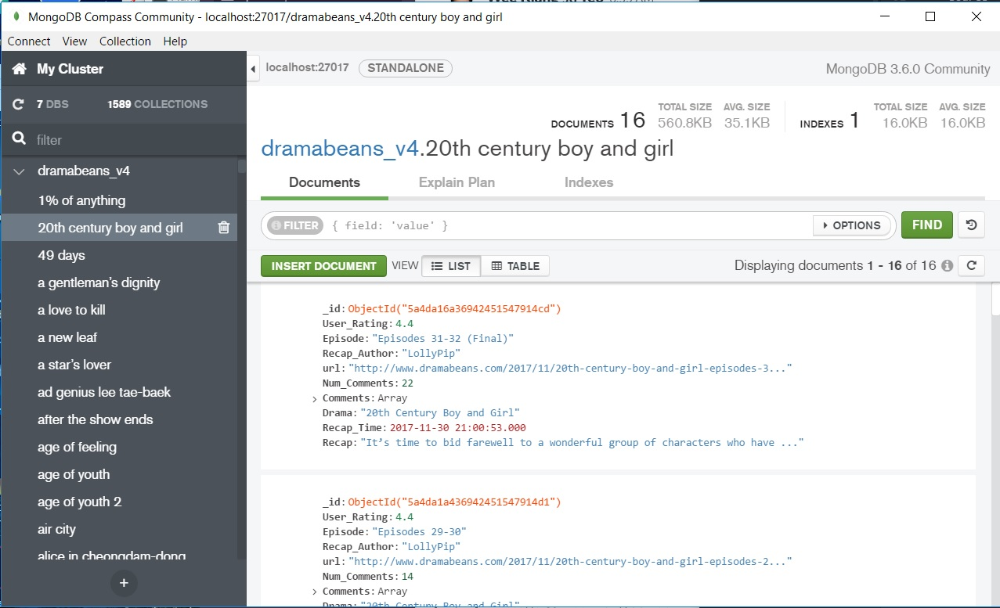
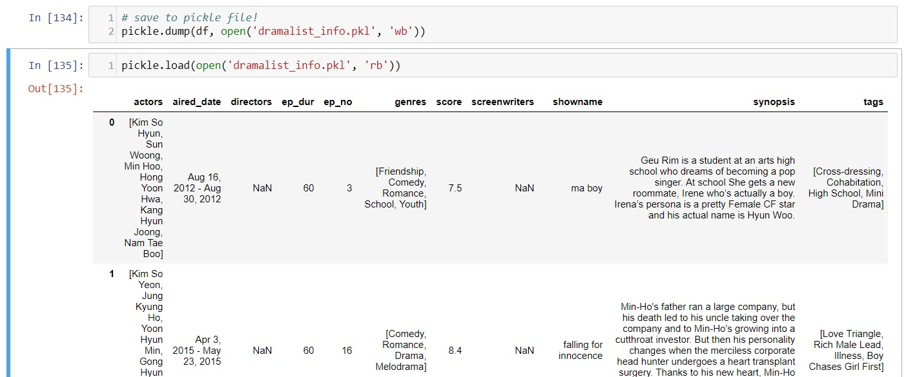
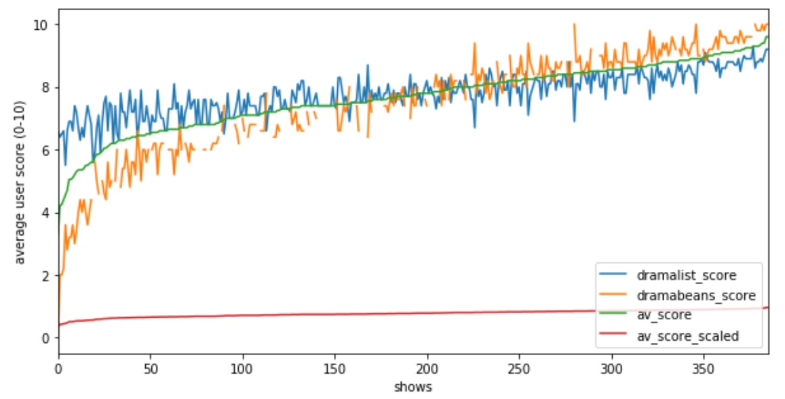
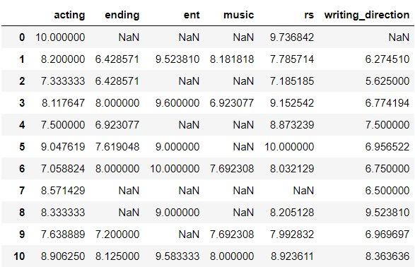
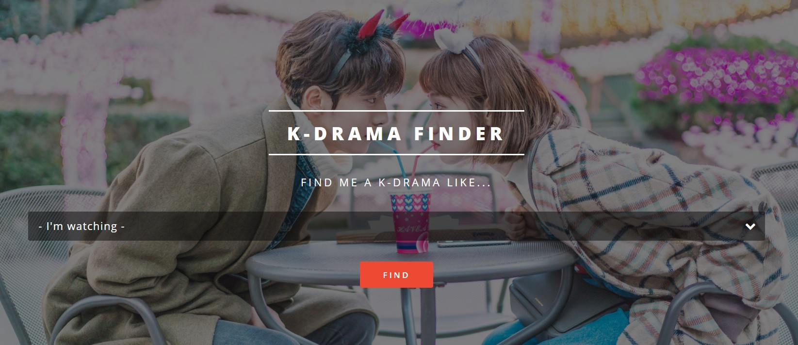

## What should I watch next?

I love watching K-dramas.

I especially enjoy watching dramas that are completed, so that I don't have to wait a week for the next episode to air. But like many other K-drama addicts, the perpetual problem I face is... *"my current drama is ending - what should I watch next??"*

This project aims to meet this need.

## Goal

#### Based on the current drama that I'm watching (or the last drama that I liked), recommend a set of dramas that have similar qualities, and tell me _why_ they were recommended.

Factors to consider when making recommendations:
- Does the drama have a similar genre (e.g. Action, Romance, etc.) or similar thematic elements (e.g. Hacking, Palaces, etc.) to the one I like?
- Do the drama share the same main actors/actresses as the one I like?
- What do others say about this drama?
- Was it rated highly by other users? How addictive is the drama?
- Does the drama have any outstanding features? Examples:
    - Great writing & directing
    - Great acting
    - Apt soundtrack / background music / sound effects

## Dataset & Web-Scraping

I scraped data from these 2 sites:
1. [Dramabeans](http://www.dramabeans.com){:target="_blank"} (my favorite K-Drama site!!): For recaps of each episode, average user rating & comments.
2. [MyDramaList](https://mydramalist.com/){:target="_blank"}: For metadata of each drama.

### Web-Scraping

Using [Selenium with Python](http://selenium-python.readthedocs.io/){:target="_blank"} and BeautifulSoup, I first scraped the Dramabeans master recaps page to get a list of URLs of all the episode recaps posted, totaling 5020 recap pages (in Dec 2017).


#### FUNCTIONS
# define a function to take in a page soup, return a list of recap urls
def geturls(listsoup):
    '''takes in a page soup, returns a list of recap urls'''

    rawlist = listsoup.find_all('h3', attrs={'class':"post-title-thumbnail"})
    recaplist = []
    for row in rawlist:
        link = row.a.get('href')

        # only save those links that are recaps
        if 'episode' in link:
            recaplist.append(link)

    return recaplist

#### SCRIPT
# create a driver called driver
capa = DesiredCapabilities.CHROME
capa["pageLoadStrategy"] = "none"

driver = webdriver.Chrome(executable_path="./chromedriver/chromedriver.exe", desired_capabilities=capa)
wait = WebDriverWait(driver, 20)

# load the main recaps page
driver.get('http://www.dramabeans.com/recaps/')
wait.until(EC.element_to_be_clickable((By.XPATH, '//nav[@class="navigation pagination"]')))
driver.execute_script("window.stop();")
sleep(1)
source = driver.page_source
listsoup = BeautifulSoup(source, 'html.parser', from_encoding='utf-8')
assert 'Recap' in listsoup.title.text
recaplist = geturls(listsoup)

# try to find the next page, click it
while pages > 1:
    nexturl = listsoup.find('div', attrs={'class':'nav-links'}).find('a', attrs={'class':'next'}).get('href')
    driver.get(nexturl)
    wait.until(EC.element_to_be_clickable((By.XPATH, '//nav[@class="navigation pagination"]')))
    driver.execute_script("window.stop();")
    sleep(1)
    source = driver.page_source
    listsoup = BeautifulSoup(source, 'html.parser', from_encoding='utf-8')
    assert 'Recap' in listsoup.title.text
    recaplist += geturls(listsoup)
    pages += -1
    print 'page ', (565-pages)
    # save as a pickle file
    pickle.dump(recaplist, open('saveurls.p', 'wb'))

# once done getting urls, close driver, print number of recap URLs
driver.close()
print 'Number of recap URLs: ', len(recaplist)



I then scraped each recap URL to obtain the recaps, average user rating and comments, saving them into a MongoDB database.

<figure>
	
	<figcaption>Dramabeans MongoDB database</figcaption>
</figure>

In a similar manner, I obtained the drama metadata from MyDramaList, containing information on the drama such as the actors, genre/tags, aired date. These I saved in a DataFrame format within a pickle file.

<figure>
	
	<figcaption>DataFrame of MyDramaList metadata</figcaption>
</figure>

Once the data was collected, I removed duplicates and fixed errors such as spelling mistakes. After cleaning, I had a total of __386 dramas, with 4,975 episodes worth of recaps and comments__.

## Approach

My approach to building the recommender system was to generate a separate score in the following categories, then aggregate them to a final score, which would determine which shows would be recommended to the user.

1. **Similarity of thematic elements** (e.g. palace, sword, war... etc.)
2. **Similarity of genre** (e.g. thriller, historical, etc.)
3. **Similarity of actors**
4. **User rating** - I want to recommend higher rated shows more often than shows with a poor user rating
5. **Measure of addictiveness** (aka. "crack" level) - I want to recommend shows which are more addictive and engaging
6. **Category Score** - I want to recommend shows which have outstanding features in the following areas:
    - Acting - how good was the acting?
    - Writing & Direction - how good was the writing and directing?
    - Music - was the soundtrack particularly outstanding?
    - Relationships - were romances/ friendships/ family relationships well represented in the show?
    - Ending - was the show wrapped up well? did it have a satisfying ending?
    - Entertainment Value - was the show fun to watch?

## (1) Feature extraction of thematic elements with TF-IDF

In order to extract the thematic elements in each show, I used packages from NLTK, spaCy and gensim.

#### Preprocessing
First, I formed a corpus of all the recaps for each show, with each show containing recaps from all the episodes. Word tokenization was done using NLTK's `nltk.tokenize`.


# put all the recaps into a dictionary
recaps = defaultdict(str)
for show in shownames:
    for doc in db[show].find():
        recaps[show] += doc['Recap']
# tokenize
tokenized = [nltk.tokenize.word_tokenize(recap)
             for recap in recaps.values()]


#### Named Entity Recognition
I needed to identify and remove names (names of the characters, companies, etc.) in the recaps, otherwise these would be picked up as key thematic features, which is not desirable. This was done using both `nltk.chunk.ne_chunk` and spaCy's built in NER, since neither was able to identify all the names. The names were then combined and saved as a list, to be used as stop words.


### NER using NLTK - first do POS tagging
tagged = [nltk.pos_tag(recap) for recap in tokenized]
# because the NLTK NER cannot handle special characters, have to remove them
weird_utf =  [u'\u2014', u'\u2019', u'\u201c', u'\u201d', u'\u2665']
tagged_clean = [[(word_tup[0].encode('utf-8').decode(), word_tup[1]) for word_tup in recap
               if word_tup[0] not in weird_utf]
               for recap in tagged ]
tagged_clean[0]
entities = [[nltk.chunk.ne_chunk(recap, binary=False)] for recap in tagged_clean]
# if binary=False, classify into GPE, PERSON, ORGANIZATION... etc.

# build list of named entities, all_ne_nltk
all_ne_nltk = []
for entity in entities:
    set_names = []
    for sent in entity:
        for chunk in sent:
            if hasattr(chunk, 'label') and chunk.label() == 'PERSON':
                set_names.append([ne for tree in chunk for ne in tree])
    all_ne_nltk.append( set([word.lower() for item in set_names for word in item if word != 'NNP']))

### NER with spaCy

# load spacy english model
nlp_spacy = spacy.load('en')
# set up the list holding all the persons identified
all_persons = []

# loop through each show, identify named entities, all_persons
for show_num in range(len(recaps)):
    # load each show's recaps into spacy nlp model
    recap = nlp_spacy(recaps.values()[show_num])
    persons = {ent.text.replace('.', '').strip() for ent in recap.ents
               if (ent.label_ in ['PERSON', 'GPE', 'ORG', 'NORP', 'FACILITY', 'PRODUCT', 'WORK_OF_ART'])
               and not (ent.text.isspace())}
    # make lowercase, don't use words with spaces or with special characters
    persons = {part.lower() for word in persons for part in word.split('-') if part.isalpha()}
    m_persons = list(persons) + [word+'s' for word in persons]
    all_persons.append(m_persons)

# combine both nltk and spacy NER for best results!!
name_stop = [list(set(show + list(all_ne_nltk[i]))) for i, show in enumerate(all_persons)]


#### Removal of stop words, Lemmatization & formation of Bigrams

Common english stop words from `nltk.corpus.stopwords` were combined with the named entities `name_stop` and excluded from the tokens. `WordNetLemmatizer()` was chosen over stemming as it was less harsh. Lastly, bigrams were created and combined with the unigrams to form the final tokenized corpus.


# define function to convert POS tag into a form that Wordnet can recognise
def pos_to_wordnet(tag):
    '''convert from nltk tag to wordnet tag'''

    if tag.startswith('J'):
        wn = 'a'
    elif tag.startswith('R'):
        wn = 'r'
    elif tag.startswith('V'):
        wn = 'v'
    else:
        wn = 'n' # the default
    return wn

# remove stopwords, punctuation, remove words that only have 1 letter, remove names, convert POS tag from NLTK to wordnet format
stop = stopwords.words('english')
stop = list(set(stop + [word.replace("'", '') for word in stop])) + ['thats', 'hed', 'hes'] # remove the apostrophes, append to stop words list
tokenized_clean = [[(word[0].strip().lower(), pos_to_wordnet(word[1])) for word in show
                    if ((word[0].strip().lower() not in stop) and (word[0].lower() not in list(name_stop[i]))) # use all_ne_nltk OR all_persons
                    if (word[0].isalpha()) and (len(word[0]) >2)] # or (('-' in word) and word !='-')
                    for i, show in enumerate(tagged)]

# lemmatise - choose lemmatizer instead of stemmer as stemming is too harsh,
# especially for korean words which we want to keep intact
stemmer = WordNetLemmatizer()
tokenized_clean_lem = [[stemmer.lemmatize(word[0], word[1]) for word in show]
                        for show in tokenized_clean]

# after lemmatisation, check for stop words again
tokenized_clean_lem = [[word for word in show if word not in stop]
                       for show in tokenized_clean_lem]

# create bigrams too
bigrms = [list(nltk.bigrams(show)) for show in tokenized_clean_lem]
bigrms = [[' '.join(list(bi)) for bi in show] for show in bigrms]
bigrms_clean_lem = [show + tokenized_clean_lem[i] for i, show in enumerate(bigrms)]


#### TF-IDF
After experimenting with the simple bag-of-words, TF-IDF and LDA from `gensim`, I obtained the best results with TF-IDF. The bag-of-words method identified the most common words to be _"asks", "calls", etc._, which were irrelevant to the theme, and LDA produced unlabelled topic groupings with multiple repeated words. TF-IDF had the best results as it penalizes common words while increasing the importance of rare words.


# create gensim dictionary & bag of words corpus
dictionary = Dictionary(bigrms_clean_lem)
corpus = [dictionary.doc2bow(show) for show in bigrms_clean_lem]

# define function to pull out top 10 words identified by TF-IDF
def topwords(bow, dictionary, num_words=10):
    '''displays the top number of words as specified by num_words
    using the bow (word_id, count/freq)'''
    bow_doc = sorted(bow, key=lambda w: w[1], reverse=True)
    for word_id, word_count in bow_doc[:num_words]:
        print dictionary.get(word_id), word_count

# tf-idf
tfidf = TfidfModel(corpus)
for i, show in enumerate(shows):
    print '------', show.upper()
    topwords(tfidf[corpus[i]], dictionary, num_words=10)

# example of tf-idf results for a youth drama:
# [u'dorm leader', u'soccer', u'thump thump', u'jumping', u'national team', u'go thump', u'principal', u'gymnasium']


I then calculated the cosine similarity of each pair of shows using the TF-IDF model of vectors, and saved them into a 386 x 386 matrix (for the 386 shows).


# compare similarity of docs
index = similarities.MatrixSimilarity(tfidf[corpus])
df_sims = pd.DataFrame(list(index))
sims = pd.DataFrame({'shownames': shows, 'similarity':index[tfidf[corpus[0]]]})
sims.sort_values('similarity', ascending=False)


## (2) Similarity by Genre

I derived the genre similarity by combining three inputs: the genres listed in the MyDramaList metadata, user-added tags from MyDramaList, and the year of release of the show (rationale being that old shows have a different production quality and "feel" than newer shows).

I built a feature matrix by one-hot-encoding the genres and tags, and added a column for the year of release of the show  After normalising all the values to the 0-1 range, the cosine similarity matrix was once again calculated for each show.


# function to create a unique set
def unique_set(items):
    '''from the input Series, create a unique list of values'''
    unique_set = []
    for item in items:
        if type(item) == list:
            unique_set +=item
    unique_set = list(set(unique_set))
    return unique_set

# function to one-hot encode
def one_hot_encode(series_items, unique_set):
    '''one hot encode for each show based on unique set of actors/genres, etc.
    series_items = series of items to one-hot encode
    return a dataframe with one-hot-encoding'''
    dummies = np.zeros((df.shape[0], len(unique_set)))
    for row, show_items in enumerate(series_items):
        for col, item in enumerate(unique_set):
            if type(show_items) == list:

                if item in show_items:
                    dummies[row, col]= 1
    # convert to dataframe
    dummies_matrix = pd.DataFrame(dummies, columns=unique_set)
    return dummies_matrix

# define a function to create the cosine similarity matrix
def create_cos_sim(num_shows, matrix):
    '''create a cosine similarity matrix of size num_shows * num_shows based on input matrix
    returns the cosine similarity matrix in dataframe format'''
    # create empty matrix
    cos_sim = np.zeros((num_shows, num_shows))
    # calculate cosine similarity for each pair of shows
    for r in range(num_shows):
        for c in range(num_shows):
            x = matrix.iloc[r,:].values.reshape(1, -1)
            y = matrix.iloc[c,:].values.reshape(1, -1)
            cos_sim[r,c] = cosine_similarity(x,y)
    # convert into dataframe
    cos_sim_df = pd.DataFrame(cos_sim)
    return cos_sim_df

# get unique set of genres & tags from all shows
genres_set = unique_set(df.genres)
tags_set = unique_set(df.tags)

# one-hot-encode genres matrix
genres_matrix = one_hot_encode(df.genres, genres_set)
tags_matrix = one_hot_encode(df.tags, tags_set)

# normalise year from 0 to 1
years = df.year.values.reshape(-1,1)
mm = MinMaxScaler()
years_s = pd.Series(mm.fit_transform(years).ravel())

# join the genres, tags & years matrices
comb_matrix = pd.concat([genres_matrix, tags_matrix, years_s], axis=1)

# create cosine similarity matrix
genres_cos_sim = create_cos_sim(df.shape[0], comb_matrix)

# save into pickle
pickle.dump(genres_cos_sim, open('genres_sim.pkl', 'wb'))
pickle.dump(genres_matrix, open('genres_matrix.pkl', 'wb'))
pickle.dump(tags_matrix, open('tags_matrix.pkl', 'wb'))


## (3) Similarity of Actors

The same method used in (2) was applied to calculate the similarity score for the actors in each show, using the MyDramaList metadata.

## (4) Average User Rating

As the Dramabeans average user rating has a maximum score of 5 while the MyDramaList rating has a maximum score of 10, I scaled the Dramabeans rating to 10 for a fair comparison. I did some EDA and found that the average user ratings of the Dramabeans and MyDramaList sites were fairly consistent, just that Dramabeans users tended to be more polar.

<figure>
	
	<figcaption>Comparison of Dramabeans and MyDramaList Average User Rating</figcaption>
</figure>

As the ratings were rather consistent, I chose to calculate the average user rating based on the mean of the Dramabeans and Dramalist scores, then scaled it to 0-1.

## (5) Addictiveness Score

I calculated the addictiveness of the show, aka, the "crack" score, based on the amount of activity generated around a show. I used the number of comments that users leave on a particular show as a proxy measure for addictiveness, as more engaged viewers tend to turn to discussion forums after each episode. I summed up the number of comments for each show left on the Dramabeans site, and used the log of the sum of comments, scaled using MinMaxScaler to 0-1.


# extract out the number of comments to form the crack score
crack = []
for show_name in ratings.showname:
    num_com = 0
    for show in db[show_name].find():
        num_com += show['Num_Comments']
    crack.append(num_com)
# scale the crack score to between 0 & 10 (to match the average score rating)
mm = MinMaxScaler()
crack_s = mm.fit_transform(np.log(crack).reshape(-1,1))


## (6) Category Score

In order to get a score for the 6 categories identified (1. Acting 2. Writing & Direction, 3. Music, 4. Relationships, 5. Ending, 6. Entertainment value), I chose to do sentiment analysis of the comments left on each episode of each show. The total number of comments analyzed was 645,188.

I tested out two sentiment analysis packages, `TextBlob` and `VADER`. For my dataset, VADER performed better as it managed to correctly categorize more comments into positive and negative categories based on the compound score.

For each show, I first separated each comment into individual sentences, as each sentence could be talking about a different aspect of the show. I then applied VADER to each sentence to generate a compound score and binned each sentence into positive (>0.3), negative (<-0.3) or neutral (-0.3 - 0.3) categories.


def bin_sentences(comments_list, threshold=0.3):
    '''bin comments into positive, negative & meutral by sentence'''
    from nltk.sentiment.vader import SentimentIntensityAnalyzer
    vader = SentimentIntensityAnalyzer()

    like_sent, dislike_sent, neutral_sent = [], [], []
    like_sent_score, dislike_sent_score, neutral_sent_score = [], [], []

    for comment in comments_list:
        comment_sents = nltk.tokenize.sent_tokenize(comment)
        for sent in comment_sents:
            score = vader.polarity_scores(sent)['compound']
            if score > threshold:
                like_sent.append(sent)
                like_sent_score.append(score)
            elif score < - threshold:
                dislike_sent.append(sent)
                dislike_sent_score.append(score)
            else:
                neutral_sent.append(sent)
                neutral_sent_score.append(score)
    return like_sent, dislike_sent, neutral_sent, like_sent_score, dislike_sent_score, neutral_sent_score


Based on a pre-defined list of keywords per category, I then checked to see if each sentence previously categorised into positive and negative categories contained a keyword (and discarded the neutral sentences). To obtain the score, I divided the number of positive sentences by the sum of the positive and negative sentences related to each category. If there were less than 10 comments, I returned an empty value.


terms_dict = {
    'writing_direction' : ['writing', 'pacing', 'storyline', 'plot', 'coherence', 'editing', 'directing', 'direction' 'cinematography'],
    'acting': ['act', 'actor', 'actress', 'acting', 'performance', 'cast'],
    'rs': ['romance', 'couple', 'ship', 'bromance', 'chemistry', 'triangle', 'OTP', 'kiss', 'cute', 'friend', 'family'],
    'ending': ['ending', 'resolution', 'finale'],
    'ent': ['entertaining', 'exciting', 'enjoyable', 'thrilling', 'suspense', 'heartwarming'\
                      'crack', 'addictive', 'comedy', 'comedic', 'charm'],
    'music': ['music', 'OST', 'soundtrack', 'sound'] }

def calc_score(pos_count, neg_count):
    '''calculate the show score (upon 10) based on number of positive and negative comments'''
    # only return score is there are at least 10 comments
    if pos_count + neg_count >=10:
        pos_ratio = pos_count / float(pos_count + neg_count) * 10
    else:
        pos_ratio = np.nan
    return pos_ratio


The resulting DataFrame of category scores looks like this:

<figure>
	
	<figcaption>Category scores</figcaption>
</figure>

## Extraction of Representative Phrases from Comments

While extracting the category scores, I also wanted to extract representative short comments describing each show, which would help to inform the user of the recommendation engine (e.g. "fast paced plot, light romantic comedy, emotional storyline"). After exploring several methods (e.g. spaCy's noun chunks) with little success, I decided to write my own function to extract out representative adjective-noun phrases from the comments.

Essentially what the function does: scan each comment to find adjectives, then search the space around that adjective for the nearest noun. If a noun is found, check if the word before the adjective is an adverb (e.g. for words like "very"). If yes, include that in the phrase.


# load spacy english model
nlp_spacy = spacy.load('en')

def extract_phrases(text, buf=2):
    '''extract adjective-noun phrases from given text string'''

    # process into spaCy
    trial_spacy = nlp_spacy(text)

    # initialise holding variables
    phrases, phrases_ind, phrases_pos = [], [], []

    # iterate through each word
    for i, t in enumerate(trial_spacy):

        # identify adjectives that are not stop words
        if (t.pos_ == 'ADJ') and (t.is_stop == False):

            # initialise variables
            f=0
            found = 0
            start = i
            end = i

            # search the space around the adjective for nouns,
            # expanding the search window by 1 each time
            while (f < buf) and (found == 0):
                # increment f
                f += 1

                # define search space, deal with start & end of sentence
                k= []
                if i-f < 0:
                    k = [0]
                else:
                    k = [i-f]
                if i+f >= len(trial_spacy):
                    k.append(len(trial_spacy)-1)
                else:
                    k.append(i+f)

                # check for nouns
                if (trial_spacy[k[0]].pos_ == 'NOUN') or (trial_spacy[k[0]].pos_ == 'PROPN'):
                    # if there is a hyphen, extend the phrase
                    try:
                        if ('-' in trial_spacy[k[0]-1].text):
                            start = k[0]-2
                            found = 1
                        else:
                            start = k[0]
                            found = 1
                    except:
                        start = k[0]
                        found = 1

                if (trial_spacy[k[1]].pos_ == 'NOUN') or (trial_spacy[k[1]].pos_ == 'PROPN'):
                    # if there is a hyphen or another noun, extend the phrase
                    try:
                        if (trial_spacy[k[1]+1].pos_=='PROPN') or (trial_spacy[k[1]+1].pos_=='NOUN'):
                            end = k[1]+1
                            found=1
                        elif ('-' in trial_spacy[k[1]+1].text) and ((trial_spacy[k[1]+2].pos_=='PROPN') or (trial_spacy[k[1]+2].pos_=='NOUN')):
                            end = k[1]+2
                            found = 1

                        else:
                            end = k[1]
                            found = 1

                    except:
                        end = k[1]
                        found = 1

            # if a noun was found, check if the word before the adjective is an adverb
            if (start == i) and (end != i):
                if (t.pos_ == 'ADJ') and (trial_spacy[i-1].pos_ == 'ADV'):
                    if i-1 >=0:
                        start = i-1
                # also check if word before is a hyphen, extend phrase if hyphen is found
                elif (u'-' in trial_spacy[i-1].text):
                    if i-2 >=0:
                        start = i-2

            # form list of phrases
            phrase_ind = range(start,end+1)
            phrase = [w.text for w in trial_spacy[start:end+1]]
            phrase_pos = [w.pos_ for w in trial_spacy[start:end+1]]

            if len(phrase_ind) == len(phrase) == len(phrase_pos):

                # exclude phrase if it cuts across punctuation marks like full stop or comma. exclude single words (no context)
                if (('-' in phrase) or ('PUNCT' not in phrase_pos)) and (len(phrase_pos)>1):

                    # if phrase overlaps with other phrases already collected, combine them
                    if phrases != []:
                        last_phrase = phrases[-1]
                        last_phrase_pos = phrases_pos[-1]
                        last_phrase_ind = phrases_ind[-1]

                        if phrase_ind[0]-1 <= last_phrase_ind[-1]:
                            phrases[-1] = [w.text for w in trial_spacy[last_phrase_ind[0]:(phrase_ind[-1]+1)]]
                            phrases_pos[-1] = [w.pos_ for w in trial_spacy[last_phrase_ind[0]:(phrase_ind[-1]+1)]]
                            phrases_ind[-1] = range(last_phrase_ind[0], phrase_ind[-1]+1)

                        else:
                            phrases.append(phrase)
                            phrases_pos.append(phrase_pos)
                            phrases_ind.append(phrase_ind)

                    else: # just append the first phrase
                        phrases.append(phrase)
                        phrases_pos.append(phrase_pos)
                        phrases_ind.append(phrase_ind)

    return phrases, phrases_pos, phrases_ind


_Other stuff the function does: deal with the start and end of sentences, hyphenated words, exclude phrases that cut across punctuation marks, combine phrases if they overlap._

Example of phrases found with the function: _"quite cute high school romance", "lovely cast", "good directing"_

## Calculating the Aggregate Score

With the 6 score components, I combined them into 1 final aggregate score (see code for more details):
- I used the maximum score out of the various categories in (6) in order to recommend shows that are outstanding in a particular area (e.g. stellar acting)
- I scaled all scores to between 0 and 1 using `MinMaxScaler` so that they are comparable
- I used a weighted mean to obtain the final score (to give more emphasis to theme and genre relative to the other factors)


# reason for recommending
def recc_reason(show):
    showname = show.pop('showname')
    agg = show.pop('aggregate')
    reason = [show.argmax()]
    show.drop(show.argmax(), inplace=True)
    reason.append(show.argmax())
    while ('Theme' not in reason) and ('Genre' not in reason) and ('Actors' not in reason) :
        show.drop(show.argmax(), inplace=True)
        reason.append(show.argmax())

    # if reason is because of sentiment score, extract out which category is good
    for i, r in enumerate(reason):
        if r == 'Sentiment':
            reason[i] = cat_scores2.loc[showname, 'reasons']
    return ', '.join(reason)

def topwords(bow, dictionary=dictionary, num_words=50):
    '''displays the top number of words as specified by num_words
    using the bow (word_id, count/freq)'''

    bow_doc = sorted(bow, key=lambda w: w[1], reverse=True)
    words = []

    for word_id, word_count in bow_doc[:num_words]:
        words.append(dictionary.get(word_id))

    return words

def find_common_themes(ind1, ind2, tfidf=tfidf, corpus=corpus, dictionary=dictionary, num_words=10):
    '''displays the common themes in the 2 shows with indices ind1 and ind'''

    words1 = set(topwords(tfidf[corpus[ind1]]))
    words2 = set(topwords(tfidf[corpus[ind2]]))
    common_themes = ', '.join(list(words1.intersection(words2)))

    return 'Similar Theme: ' + common_themes.title()

reccs = {}
for i in metadata.index:

    # combine all the scores into 1 matrix
    comb = pd.concat([metadata.showname, tfidf_sims[i], genres_sims[i], actor_sims[i], ratings[['av_score_scaled', 'crack_scaled']], cat_scores['max_scaled']], axis=1)
    comb.columns = ['showname', 'theme', 'genre', 'actor', 'av_rating', 'crack', 'sentiment']

    # drop the selected show
    comb.drop(i, axis=0, inplace=True)

    # impute the missing values in the sentiment scores with the min value, rounded down
    comb.sentiment.fillna(np.round(comb.sentiment.min(), decimals=1), inplace=True)

    # rescale and add weights
    mm = MinMaxScaler()
    comb.theme = mm.fit_transform(comb.theme.values.reshape(-1, 1))
    comb.genre = mm.fit_transform(comb.genre.values.reshape(-1, 1))
    comb.actor = mm.fit_transform(comb.actor.values.reshape(-1, 1))*.75
    comb.av_rating = mm.fit_transform(comb.av_rating.values.reshape(-1, 1))*.8
    comb.crack = mm.fit_transform(comb.crack.values.reshape(-1, 1))*.85
    comb.sentiment = mm.fit_transform(comb.sentiment.values.reshape(-1, 1))*.8

    # rename columns
    comb.columns = ['showname', 'Theme', 'Genre', 'Actors', 'High user rating', 'Addictiveness', 'Sentiment']

    # calculate aggregate score
    best = comb.copy()
    best['aggregate'] = comb.mean(axis=1, skipna=True)

    # find reason for recommendation
    best['reason'] = best.apply(recc_reason, axis=1)

    # extract top shows, put into dataframe top
    top = best.sort_values('aggregate', ascending=False).head(10)

    # extract details for reason for recommending show
    details = []
    for ind in top.index:
        detailed_reason = []

        # extract common actors
        if top.loc[ind, 'Actors'] != 0:
            common_actors = actor_matrix.loc[[i, ind], :].sum().sort_values(ascending=False)
            common_actors = list(common_actors[common_actors ==2].index)
            detailed_reason.append('Actors in Common: ' + ', '.join(common_actors))
        # extract common genre
        if 'Genre' in top.loc[ind, 'reason']:
            common_genres = genres_matrix.loc[[i, ind], :].sum().sort_values(ascending=False)
            common_genres = list(common_genres[common_genres ==2].index)
            common_tags = tags_matrix.loc[[i, ind], :].sum().sort_values(ascending=False)
            common_tags = list(common_tags[common_tags ==2].index)
            detailed_reason.append('Similar Genre: '+ ', '.join(common_genres + common_tags))
        if 'Theme' in top.loc[ind, 'reason']:
            common_themes = find_common_themes(i, ind)
            detailed_reason.append(common_themes)

        details.append(detailed_reason)
    top['details'] = details

    # extract comments for each show
    comments = []
    for ind in top.index:
        comments.append(cat_scores.loc[ind, 'comments'])
    top['comments'] = comments

    # put into dictionary
    reccs[i] = top

    # print status
    print i,


## Putting it all together with Flask

Finally, I put it all together with [Flask](http://flask.pocoo.org/){:target="_blank"}!

<figure>
	
</figure>

<a href="https://k-drama-finder.herokuapp.com/" target="_blank" class="btn btn-info">Check it out!</a>

----

### Future Work

Other stuff to explore for next time!
- NLG of show descriptors with LSTM/ RNN
- Using deep learning to train a classifier for comment categories instead of using keywords

### Find it all on GitHub

All code can be found on [my Github](https://github.com/heidicq/dsi2-projects/tree/master/project-capstone).
