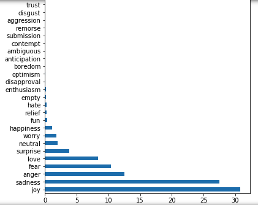

## Background  
> "What is on your mind?... What are you thinking about?... A penny for your thoughts?" For most of us, experiencing, intepreting, understanding and reacting to our own emotional states and those around us are very much a part of our daily interactions at the workplace, at home with our family members and other social settings; reacting appropriately to different situations based on the emotional context is key to developing meaningful personal / business relationships. I suspect this is why friends often prefer meeting up in person / business executives insist on having face to face negotiations etc. However, appreciation of emotional context is often done in-person - and for good reason - we read emotions best based on tonality, body-language, facial expressions and many other verbal and non-verbal cues perceived both consciously and sub-consciously. For this reason, emotional interpretation is largely limited to a localised / small settings. 
> But what if we could glean information on emotional responses 'en-masse' using other less conventional methods? For example, by analyzing the 'tonality' based on a particular style of writing or 'expressions' based on punctuations or other key words used from textual input? What if we could tell how a hundred, or a thousand people are feeling at a particular point in time and specifically about what -- in real time no less. These questions motivated my research into the field of Natural Language Processing (NLP) and the development of a tool that is built on both traditional Machine Learning/NLP concepts but also lexical rule-based libraries that other researchers have built to efficiently provide 'emotional data' en-masse starting with text as input.  

## Problem Statement 
It is difficult to gather emotional feedback at scale. A potential way to do so is to mine and interpret readily available but hard to interpret unstructured forms of input (like text on social media). 

The following are some examples of potential painpoints/use cases for 'emotional-listening': 

1. Costly and time-consuming to gather mass implicit feedback: 
Information on the emotional response to an event (could be a press release, a public speech etc) could be helpful for better decision making (e.g. reactions toward a certain action or policy) but obtaining this implicit feedback in real-time and on a mass level is often costly and time-consuming, if even possible. While explicit emotional feedback could be obtained from social media platforms like facebook (e.g by calculating the % of likes, or angry emojis reacts etc) this would only provide a snapshot in reaction to something (i.e. a secondary reaction). It would be more powerful if we could get that same analysis implicitly based on individual's textual input (a primary reaction) on publicly accessible platforms. 

2. Preventive action: 
Unfortunate events like mass-killings are often preceded by telling messages indicative of troubled emotions before the incidents happen but are usually only discovered only post-mortem.    

3. Augmented sentiment analysis: 
Current sentiment analysis is usually binary. However, even within the broad categories of ‘good’ or ‘bad’ it would be helpful to understand what kind of ‘good’ or ‘bad’ -- and at what intensities -- in order to respond more appropriately to the reaction. 

For example, a product review of an Iphone could have been assigned a 'bad' / negative sentiment score but this negative sentiment could have been disappointment, anger or any other 'negative' emotion for that matter - in which case, (Apple's) response would be very different; the user could be disappointed that a particular feature was not released, or angry that the quality of the phone is sub-par. The former reaction could be considered as a subjective opinion that would be good to keep in mind as a potential feature add on for future releases whereas the latter reaction would need to be re-examined with much greater urgency as the potential ramifications of a faulty phone is much greater.   

## Proposed Solution 
Developing a web-application that takes in textual input and provides real-time predicion of emotions and associated key-words at a sentence level    

## Other Use-cases 
    
1. Emotional analysis as an additional data point for digital marketing 

2. Better recommendation systems (think Spotify songs that are mood appropriate) 

3. Real time 'emotional-listening' used to pre-empt bad events from happening  

4. Used for more granular sentiment analysis (for policy makers, anything thats find an emotional response informative)

5. Mental health tracker: individuals can journal and put their journal through this analyser, which will help to track their emotions at chosen time intervals over time 

6. To help with disabilities: if a speech to text function can pass info through this model to return feedback on emotions, it can help those with an impaired ability to pick up emotional nuances through daily text/speech based interactions.

8. In general, as an additional data point — layered on top of other structured and unstructured data inputs (ppl posting live videos on facebook, insta-stories etc) 

## Methods Applied 
    
1. Natural Language Processing: pre-process text (vectorizing, lemmatizing etc), and to break it down in a way that best captures the context and sentiment of the textual input (e.g. n-grams, number of word features)  

2. Classification modelling: train the model against the tagged emotional state to accurately classify emotions according to textual input using an appropriate statistic model  

3. Lexical Rule-based libraries: lexical libraries that have been manually curated to pre-assign sentiment scores to specific key-words, word orderings etc according to a rule-based approach.  

## Data 
1. Pre-tagged Kaggle dataset for emotions based on 450,000 tweets  
2. Pre-tagged Figure-eight dataset (~50,000) text messages 
3. Pre-tagged Figure-eight dataset (~2,500) text inputs 

## Implementation Considerations  

- How should I score emotions? What kind of scale? (Need to find some kind of objective and standardised way to score text input and map that against an emotional scale) 

- How many emotions do I want to classify? (it could officially go up to 27) 

- How would I delineate one emotion from another? (e.g. anger vs annoyance. Should they exist along some kind of spectrum?) 

- how do I deal with complex emotions? (individuals can experience multiple emotions at once) -> would be nice to map it onto a spider graph and show how much of each emotion is being expressed through that textual input 

- what other features are relevant for this study? (e.g. keep layering study with other data inputs like bio-chemical info, personality etc) 

- What is the level of granularity that i should be breaking down the text input to for analysis? (n-gram word level, sentence, paragraph?) 

# Data Cleaning and Pre-Processing

## Combining 3 datasets 

The Kaggle dataset (~415,000 tweets) had been pre-tagged according to 6 emotional states ('sadness', 'joy', 'anger', 'fear', 'surprise'). As I didn't have to scrape for these inputs off Twitter directly there was much less pre-processing to be done (e.g. in terms of cleaning up the HTML or accessing the correct data in a nested dictionary as is usually the case with raw data scrapes)  

The Figure eights datasets had fewer observations (~40,000 and 2,500 respectively) but a wider range of 13 and 18 emotions. Similar to the kaggle dataset, Figure eight had already ordered the inputs nicely into a .csv file which I could load directly into my Jupyter notebook for further processing.   

Overview of the emotions captured in the 3 datasets:

1. 'sadness', 'joy', 'love', 'anger', 'fear', 'surprise'

2. 'empty', 'sadness', 'enthusiasm', 'neutral', 'worry', 'surprise', 'love', 'fun', 'hate', 'happiness', 'boredom', 'relief', 'anger'

3. 'Neutral', 'Anger', 'Optimism', 'Disgust', 'Sadness','Anticipation', 'Aggression', 'Submission', 'Love', 'Surprise','Contempt', 'Disapproval', 'Remorse', 'Ambiguous', 'Fear', 'Joy',

After cleaning out the unecessary columns and re-naming some column headings to ensure consistency, I concatenanted all 3 datasets containing all emotional states.  

<figure>
	
	<figcaption>Bar chart showing all emotions from 3 datasets (%) </figcaption>
</figure>

## Problem of Imbalanced Data

There was clearly a long-tail of (more nuanced) emotion-types that had far less observations than other 'plain-vanilla' emotional types like 'joy', 'anger' etc. This would lead to an imbalanced dataset that would impact the model's prediction accuracy as it would not have as many datapoints of the less represented emotions to be sufficiently 'trained' on. 

For this reason, I chose to subset only the top 8 emotions by count to form the final dataset that I would be training my model on. 

<figure>
	
	<figcaption> % Breakdown of Emotion Shortlist </figcaption>
</figure>

<figure>
	
	<figcaption>Bar chart showing Emotion Shortlist </figcaption>
</figure>

However, as we can tell, even after shortlisting the top 8 emotions by count, there is still a rather large imbalance (as % of total observations) between top 8 emotions. I plan to deal with this using traditional random upsampling within each emotion-class after train-test-split, in order to prevent the same observations from being present in both the training and testing sets. 

I did not balance out the classes during the construction of my baseline-model. 

> briefly discuss up-sampling techniques, what SMOTE is and why it might not work in this context 
> discuss the performance difference btw baseline VS tuned model 
> include more classification evaluation metrics (e.g. recall and precision and not just accuracy) 
(to augment model) 
> upsample either via SMOTE or normal random upsampling 
> increase word feature to 7500
> use TFIDF instead of count vect 
> try out RNN (maybe) 

## Cleaning up training set text input 

Wrote a function that takes in the raw text input from the training set, strips it of non-letters, converts it to lower case, removes all stopwords and lemmatizes the words before concatenating individual words back into a 'cleaned' string. 

I used this 'cleaned' input as the basis for the building of my base line model. 



import libraries
from bs4 import BeautifulSoup   
import regex as re
from nltk.corpus import stopwords 
from nltk.stem import WordNetLemmatizer

# Instantiate lemmatizer 
lemmatizer = WordNetLemmatizer()

# Cleaning Function 
def clean_text(raw_post):
    
    # 1. Remove HTML.
    review_text = BeautifulSoup(raw_post).get_text()
    
    # 2. Remove non-letters.
    letters_only = re.sub("[^a-zA-Z]", " ", review_text)
    
    # 3. Convert to lower case, split into individual words.
    words = letters_only.lower().split()
    # Notice that we did this in one line!
    
    # 4. In Python, searching a set is much faster than searching
    # a list, so convert the stop words to a set.
    stops = set(stopwords.words('english'))
    
    # 5. Remove stop words.
    meaningful_words = [w for w in words if not w in stops]
    
    # 6. Lematize 
    lem_meaningful_words = [lemmatizer.lemmatize(i) for i in meaningful_words]
    
    # 7. Join the words back into one string separated by space, 
    # and return the result.
    return(" ".join(lem_meaningful_words))



## Difficulties
    
1. Text as a pure emotion analyser would be difficult as there is so much that is lost when we exclude the verbal intonations, facial expressions etc so can think about how you can compensate for those things in your analysis (e.g. picking up bold, or italics, exclamations, or emojis etc) could also consider how I can maybe augment the dataset with other features to better predict for emotion? 

2. a single textual input could referce multiple emotional states at varying points in time e.g. someone recouting his or her emotions throughout the day. How to reconcile this? the overall emotional state on balance? 

3. things like sarcasm, or passive-aggressiveness would be hard to detect and even so, to classify as a particular emotion

4. pejoratives (words expressed as neutral or even positive statements to mask a negative sentiment) e.g. 'the chicken had a unique taste... or his idea was interesting..." 

5. picking up emotional-nuances expressed in non-textual cues like emoticons or accents like bold, italics etc e.g. ... or :>, **angry** etc 

6. slang is localised. so the model would probably not perform well in different cultural contexts unless it is trained on multiple localised datasets (e.g. American slang used to connote certain emotions are not the same as those that Singaporeans would use) slang is also dynamic in nature (this is why things like urban dictionary exist because new words are always getting added to it) this also means that the model will have to be continuously trained on new datasets/ add new words to an emotion library 

7. lexical methods are context specific; vocab that connotes specific emotion differ from setting to setting. (e.g. lexical anaylsis for social media would be alot more slang/emoticon heavy whereas the same for formal writing would not) So a model trained on a social media based dataset would probably not do as well when interpreting the emotions of formal prose. 

8. humans experience complex emotions (it's hard enough for a human to accurately interpret emotion, not to mention computers...) so it would be important to objectively quantify that complex expression in some way. Also to figure out which emotions are compatible with each other and which aren't. (e.g. you can be both happy and excited at the same time... but happy and angry? ... possible?) "locating your current emotional state in a N-dimensional emotional plane - plotted over time would form your emotional cloud "
note to self: i think this can be captured in the theory of valence - which classifies emotions into generally positive or negative sentiments
https://en.wikipedia.org/wiki/Valence_(psychology)

9. dealing with imbalanced classes of emotions (general emotions like joy or sadness would be classified far more often than more nuanced ones like emptiness..) more broadly speaking, the process of classifying emotions is tricky because sometimes we don't even know how to particularize our emotions in words.  

10. dataset is currently being trained largely on individual sentences. Not sure how well the model would perform on larger chunks of texs e.g. paragraphs - **find some way to split the analysis up to the sentence? e.g. within paragraphs**  

11. will cleaning technique differ depending on subsequent method of analysis adopted? (e.g. if VADER uses emoticons and Caps to detect valence then we probably shouldnt strip the text of non-textual input and lowercase everything)

